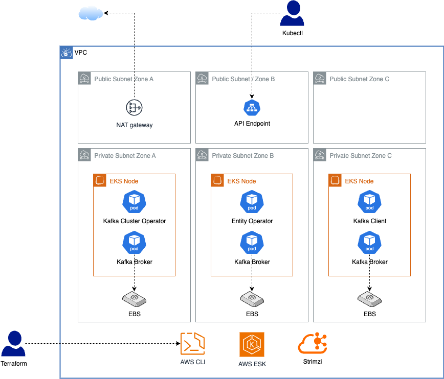

# Kafka Cluster Technical Challenge

This repository contains the setup for a 3-node Kafka cluster as part of a technical challenge.  
The goal is to demonstrate skills in infrastructure automation, Kubernetes, and Kafka configuration.

<!-- TOC -->
* [Kafka Cluster Technical Challenge](#kafka-cluster-technical-challenge)
  * [Challenge Requirements](#challenge-requirements)
  * [Solution](#solution-)
  * [Setup Instructions](#setup-instructions)
    * [Provision Infrastructure with Terraform](#provision-infrastructure-with-terraform)
    * [Deploy Kafka Cluster](#deploy-kafka-cluster)
    * [Certificates and User Setup](#certificates-and-user-setup)
<!-- TOC -->

## Challenge Requirements

1. Deploy a fully functioning 3-node Kafka cluster locally or on a public cloud provider (no SaaS services like Confluent Cloud, AWS MSK, or Azure Event Hub).
2. Automate the deployment as much as possible.
3. Configure Kafka brokers with:
    - PLAINTEXT (unauthenticated) listener.
    - One authenticated listener (SSL or Kerberos).  
      Communication between brokers must use SSL authentication.

[Challenge PDF](./DevOps-Exercise-Kafka-Generic.pdf)


---

## Solution 

- **Platform**: AWS EKS cluster with 3 managed worker nodes running Kubernetes.
- **Kafka Distribution**: Strimzi operator provisioning a 3-broker Kafka cluster (KRaft), managed fully via Kubernetes CRDs.
- **Automation**: 
  - Terraform scripts to provision the AWS infrastructure and EKS cluster.
  - Cluster and Kafka resources defined as Kubernetes manifests. Topics and users are managed declaratively as Kubernetes resources.
- **Networking & Security**:
   - Exposed two listeners: PLAINTEXT (unauthenticated) and TLS with mTLS for client authentication.
   - Inter-broker communication secured with SSL. Strimzi automatically generates certificates for brokers and clients.
- **Testing**: Deployed a Kafka client pod inside the cluster and verified end-to-end with `kafka-console-producer` / `kafka-console-consumer`:
   - One client connected via PLAINTEXT
   - Another via TLS (mTLS) to the authenticated listener
- **Out of scope for now**:
   - Kerberos integration
   - Production monitoring



| Component                     | Description                                                                                        |
|-------------------------------|----------------------------------------------------------------------------------------------------|
| **Cluster Operator**          | Manages the lifecycle of Kafka resources in Kubernetes.                                            |
| **Entity Operator**           | Handles Kafka topic and user management.                                                           |
| **Kafka Broker**              | Kafka broker and controller in KRaft mode, stores metadata and serves client requests.             |
| **Kafka Client**              | Utility pod for producing and consuming messages                                                   |
| **NAT Gateway**               | Allows outbound internet access for resources in private subnets (e.g. downloading images).        |
| **EKS**                       | Managed Kubernetes control plane provided by AWS to run containerized workloads.                   |
| **EKS Managed Nodes**         | EC2 worker nodes in the EKS cluster.                                                               |
| **EKS API Endpoint**          | API server endpoint to access the EKS cluster using `kubectl`. (currently limited to the local IP) |
| **Public Subnets (3 zones)**  | Subnets in each availability zone with internet access, used for public-facing resources.          |
| **Private Subnets (3 zones)** | Subnets in each availability zone without direct internet access, used for internal workloads.     |
| **EBS (Elastic Block Store)** | Persistent storage volumes used by Kafka brokers for durable message storage.                      |
| **Terraform**                 | Used to provision and manage AWS infrastructure and EKS resources declaratively.                   |


## Setup Instructions

### Provision Infrastructure with Terraform

```bash
cd terraform
terraform init
terraform apply -auto-approve
```

Configure kubectl to use the EKS cluster:
```bash
aws eks update-kubeconfig \
  --name   "$(terraform output -raw cluster_name)" \
  --region "$(terraform output -raw cluster_region)"
```
Access to the API endpoint is restricted to the local IP. In production, the API endpoint should be placed in a private network and accessed via a VPN.

Install Storage Class:
```bash
kubectl apply -f storageclass-ebs-gp3-wffc.yaml
```
This step is required to enable access to block storage (EBS) inside the Kubernetes cluster.

### Deploy Kafka Cluster

Install the Strimzi Kafka Operator:
```bash
kubectl create namespace kafka
kubectl create -f 'https://strimzi.io/install/latest?namespace=kafka' -n kafka
```

Deploy the 3-node Kafka cluster. The cluster uses KRaft and dual role (broker and controller) mode.
```bash
kubectl apply -f kafka-cluster.yaml -n kafka
```


### Certificates and User Setup

Create the topics and users. The certificates are generated automatically by Strimzi:
```bash
kubectl apply -f kafka-topics.yaml -n kafka
kubectl apply -f kafka-users.yaml -n kafka
```

Start a test client to interact with the Kafka cluster. The certificates generated by Strimzi are mounted in the client pod:
```bash
kubectl apply -f kafka-client.yaml -n kafka
kubectl exec -it kafka-client -- /bin/bash
```

To produce and cosume messages with the topic that does not require authentication:
```bash
kafka-console-producer --bootstrap-server kafka-cluster-kafka-bootstrap:9092 --topic unauthenticated-topic
kafka-console-consumer --bootstrap-server kafka-cluster-kafka-bootstrap:9092 --topic unauthenticated-topic --from-beginning
```

To produce and consume messages with the topic that requires authentication we need to first create the keystore and truststore.

The password for the keystore and truststore is the same as the one generated by Strimzi: `cat /opt/kafka/certs/user.password`

```bash
keytool -keystore /tmp/user-truststore.jks -alias CARoot -import -file /opt/kafka/ca/ca.crt
keytool -importkeystore -srckeystore /opt/kafka/certs/user.p12 -srcstoretype pkcs12 -destkeystore /tmp/user-keystore.jks -deststoretype jks
```

Then we can produce and consume messages with the topic that requires authentication:
```bash
kafka-console-producer --bootstrap-server kafka-cluster-kafka-bootstrap:9093 \
  --topic tls-test-topic \
  --producer.config <(echo "security.protocol=SSL
ssl.truststore.location=/tmp/user-truststore.jks
ssl.truststore.password=tjdDQ5mneBXI4qzBTWQkYohhE9CnjRAX
ssl.keystore.location=/tmp/user-keystore.jks
ssl.keystore.password=tjdDQ5mneBXI4qzBTWQkYohhE9CnjRAX
ssl.key.password=tjdDQ5mneBXI4qzBTWQkYohhE9CnjRAX")

kafka-console-consumer --bootstrap-server kafka-cluster-kafka-bootstrap:9093 \
  --topic tls-test-topic \
  --from-beginning \
  --consumer.config <(echo "security.protocol=SSL
ssl.truststore.location=/tmp/user-truststore.jks
ssl.truststore.password=tjdDQ5mneBXI4qzBTWQkYohhE9CnjRAX
ssl.keystore.location=/tmp/user-keystore.jks
ssl.keystore.password=tjdDQ5mneBXI4qzBTWQkYohhE9CnjRAX
ssl.key.password=tjdDQ5mneBXI4qzBTWQkYohhE9CnjRAX")
```